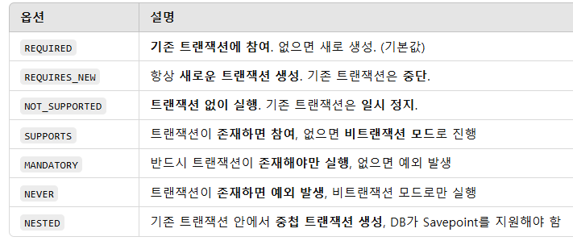
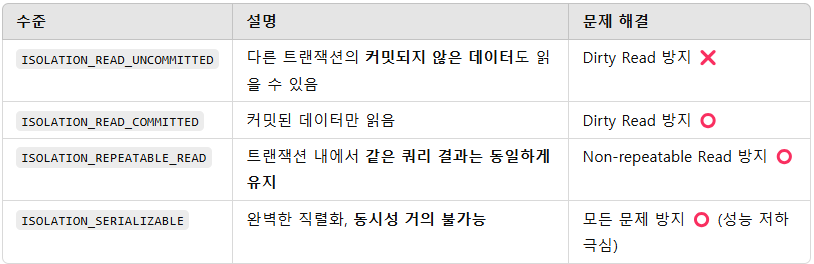

**# 📘 Chapter 6. 트랜잭션 속성 (Transaction Attributes)
Spring에서 트랜잭션은 단순한 DB 작업 단위가 아니라, <br>
애플리케이션의 일관성과 안정성을 보장하는 핵심 기술입니다.  
해당 장에서는 트랜잭션의 핵심 속성과 그 동작 방식에 대해 다룹니다.

##  TransactionDefinition 인터페이스란?
Spring에서 트랜잭션의 동작 방식은 TransactionDefinition 인터페이스를 통해 정의됩니다.<br>
이 인터페이스는 트랜잭션이 어떻게 시작되고, 처리되고, 종료될 것인지에 대한 정책을 담고 있습니다.

## TransactionDefinition의 4가지 주요 속성
전파 속성 (Propagation)

격리 수준 (Isolation)

제한 시간 (Timeout)

읽기 전용 (Read-Only)

이 4가지 속성은 DefaultTransactionDefinition 클래스에 의해 기본 구현되어 있으며, <br>스프링이 내부적으로 트랜잭션을 생성할 때 사용됩니다.

### 1. 트랜잭션 전파 
이미 트랜잭션이 존재하는 상황에서 새로운 트랜잭션이 요청될 경우, 기존 트랜잭션에 합류할지,
<br>새로 생성할지, 트랜잭션 없이 진행할지를 결정합니다.

#### 전파 속성 옵션 종류


#### 실무 예시: REQUIRES_NEW 사용
```java
@Service
public class NotificationService {

    @Transactional(propagation = Propagation.REQUIRES_NEW)
    public void sendNotification(String userId) {
        // 독립적으로 처리되어야 할 알림 전송 로직
    }
}
```

> 보통 주문 로직에서 알림 전송은 반드시 별도로 커밋되어야 하는 경우 사용합니다.

<hr>

### 2. 트랜잭션 격리 수준
동시에 여러 트랜잭션이 실행될 때 발생하는 데이터 불일치 문제를 방지하기 위한 제어 수준입니다.

#### 격리 수준 정리

> 기본값은 ISOLATION_DEFAULT이며, 이는 DBMS의 기본 격리 수준(MySQL은 READ_COMMITTED)을 사용함.

<hr>

### 3. 트랜잭션 제한 시간 (Timeout)
트랜잭션이 수행되는 최대 시간을 지정합니다.
지정된 시간 내에 작업이 완료되지 않으면 트랜잭션은 rollback 됩니다.

```java
@Transactional(timeout = 3)  // 3초 내에 트랜잭션 작업 완료 필요
public void processHeavyTask() {
...
}
```
>DB Lock 대기, 대량의 처리로 인한 지연 등에 대한 보호장치로 활용 가능합니다.

<hr>

### 4. 읽기 전용 
데이터를 조회만 하는 트랜잭션이라면,<br>
read-only 속성을 통해 불필요한 변경 감지 및 플러시 방지가 가능합니다.

```java
@Transactional(readOnly = true)
public List<User> getAllUsers() {
return userRepository.findAll();
}
```
#### 실무에서 실무 효과를 생각한다면 ?
- JPA: flush 시 dirty checking을 하지 않음 → 성능 개선
- MyBatis, JDBC: 일부 DB에서 쿼리 최적화 힌트 제공

>💡 단, DB 쓰기 작업이 들어가더라도 강제로 막히는 건 아님. 개발자의 주의가 필요함.

<hr>

### ⚠️ 주의: 내부 메서드 호출 시 트랜잭션이 적용되지 않는 이유
Spring AOP 기반 트랜잭션은 프록시 객체를 통해 트랜잭션 부가기능이 적용됩니다. <br>
같은 클래스 내부에서 메서드를 호출하면 프록시를 거치지 않기 때문에 트랜잭션이 적용되지 않습니다.

#### 잘못된 예 (프록시 우회 하면)
```java
@Service
public class OrderService {

    @Transactional
    public void placeOrder() {
        saveOrder(); // 프록시를 거치지 않음 → 트랜잭션 적용 안 됨
    }

    @Transactional
    public void saveOrder() {
        ...
    }
}
```

#### 해결 방법은 ?
1. 메서드를 외부 클래스로 분리
2. ApplicationContext를 통해 자신을 주입받아 호출
3. AspectJ를 통한 컴파일타임 AOP 사용 (비권장)

<hr>


### 💡 기타 참고 사항
readOnly, timeout 등의 속성은 트랜잭션을 새로 시작할 때만 적용됨

#### 예외 처리 시
- Unchecked Exception → 자동 rollback
- Checked Exception → rollback 안 함 (원하면 @Transactional(rollbackFor = ...) 필요)

<hr>

### 실무 팁 (찾아봄)
- 트랜잭션을 작은 단위로 분리하여 설계하라
- 필요 이상의 트랜잭션 범위를 설정하지 마라
- DB 락이 발생할 수 있는 구조는 사전에 고려하라
- 트랜잭션 테스트는 rollback 되는 @Transactional 테스트로 격리성을 확보하라

<hr>

## 질문 5가지 생겼다.
#### 1.JPA에서 @Transactional(readOnly = true)는 어떤 성능 최적화를 만들어내는것일까? <br>단순히 읽기용이란 의미 외에 내부적으로 어떤 일이 벌어질까?
내가 생각 했을때, 중요한 핵심 포인트는
1. flush 동작 여부
2. dirty checking 최적화
3. 하이버네이트가 flushMode를 어떻게 조정하는지

>실무에서는 조회 전용 서비스에 전부 readOnly 붙여서 설정하는 걸 기본 정책으로 삼기도 합니다.

### 2. 트랜잭션 전파 속성 REQUIRES_NEW를 실제 프로젝트에서 언제 사용해봤을까? 왜 필요했고, 어떤 문제가 생길 수 있을까?

핵심 포인트 ?

1. REQUIRES_NEW로 로그 저장/알림 발송 로직을 메인 로직과 분리

2. rollback 분리 목적

3. 하지만 중첩 트랜잭션 사용 시 DB 락 or 트랜잭션 timeout 충돌 경험?

> 예: 주문은 롤백돼도 알림은 보내야 하는 상황

### 3. JPA 환경에서 트랜잭션 격리 수준을 조정한 경험이 있을 수 있을까 어떻게 하면 경험할 수 있을까? 그리고 만약  격리 수준 변경이 어떤 영향을 줬고, 어떤 이슈를 방지해야하는 것일까?
핵심 포인트 ?

1. REPEATABLE_READ가 MySQL에서 기본 (InnoDB)
2. 동시 주문 시 재고 처리, 낙관적/비관적 락 대안
3. phantom read 방지 관련 실무 예시? (이는 저도 알아보는중,,)

> 실무에서는 격리 수준보단 락 처리로 해결하는 경우가 많음. 왜 그런 것인지?  하지만 격리 수준도 성능과 정확성의 균형 문제로 다뤄질 수 있는거 아닌가?.

### 4."트랜잭션이 적용되지 않는 상황을 경험? 적용될 줄 알았는데 적용되지 않아서 문제가 된 케이스는??
핵심 포인트 ?

1. 같은 클래스 내 메서드 호출 (self-invocation) → 트랜잭션 미적용
2. 프록시 기반 AOP 원리 이해
3. 해결책으로 분리 설계 또는 AOP 대체 방식 고민

> 실무에서 진짜 자주 발생하는 문제! 트랜잭션이 걸린 줄 알고 insert했는데 rollback 안 되는 상황. ㅋㅋ 저도 겪어봄...

### 5. 대량 배치 처리를 할 때 트랜잭션을 어떻게 관리해야 할까? 100만 건 처리해야 할 때 하나의 트랜잭션으로 처리하는 게 좋을까?
핵심 포인트 ?
1. 트랜잭션 시간/메모리 제한
2. chunk 단위 커밋 전략
3. Spring Batch or 수동 flush/clear 전략

> 실무에서 대용량 insert/update/delete 시 성능 문제와 트랜잭션 timeout, OOM 문제가 자주 발생함.<br> 이런 걸 사전에 어떻게 나눌 것인지 전략을 세우는 게 중요하다는데 어떻게 전략을 세우는 것인지 아는지. 
>

