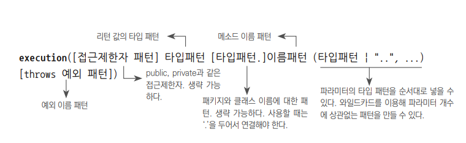

## 6.4 스프링의 프록시 팩토리 빈

#### 스프링의 ProxyFactoryBean
여러 개의 부가기능을 제공해주는 프록시를 만들 수 있다 
Advice 구현 -> MethodInterceptor 
어드바이스(advice): 타깃 객체에 적용하는 부가기능을 담은 객체 
프록시가 구현해야 하는 인터페이스를 만들 필요가 없어진다: 인터페이스 자동 검출 기능이 있다

#### 메소드 선정 알고리즘(Pointcut)
Invocation 콜백의 역할: 
타깃 객체의 레퍼런스를 갖고 있고 이를 이용해 타깃 메소드를 직접 호출하는 것

어드바이스는 타깃 정보라는 상태를 가질 수 없다(무상태성)

프록시와 어드바이스와 포인트컷을 독립시키고 의존성 주입 사용 <- 전략 패턴 구조

ProxyFactoryBean : 여러 개의 어드바이스와 포인트컷을 등록할 수 있다 
포인트컷과 어드바이스를 따로 등록할 경우 어떤 포인트 컷을 적용할지 애매하다 
-> Advisor 타입의 객체에 담아서 조합을 만들어 등록한다

#### Advisor = Pointcut + Advice

리플렉션을 통한 타깃 메소드 호출 작업의 여려움은 MethodInvocation 타입의 콜백을 이용해 제거할 수 있다

해결해야할 문제: 타깃 오브젝트마다 비슷한 내용의 ProxyFactoryBEan 빈 설정정보 추가

의미 있는 부가기능/트랜잭션: 코드(동적 생성) 
기계적 코드/인터페이스 구현, 위임, 부가기능 연동: 자동생성

#### DefaultAdvisorAutoProxyCreator
스프링 빈 후처리기 중 하나 
어드바이저를 이용한 자동 프록시 생성기

자동 프록시 생성 빈 후처리기 
빈 객체의 프로퍼티를 강제 수정할 수 있다 
별도의 초기화 작업을 수행할 수 있다 
만들어진 빈 객체를 서로 바꿀 수 있다 
빈 객체의 일부를 프록시로 포장하고 프록시를 빈으로 대신 등록할 수 있다

포인트컷이 클래스 필터까지 동작해서 클래스를 걸러버리면 아무리 프록시를 적용해도 부가기능은 제공되지 않는다 
클래스 필터에서 통과하지 못한 대상: 어떤 메소드에도 부가기능이 적용되지 않는다 
-> 프록시를 만들 필요가 없다

#### DefaultAdvisorAutoProxyCreator
등록된 빈 중에서 Advisor 인터페이스를 구현한 것을 모두 찾는다 
생성되는 모든 빈에 대해 어드바이저의 포인트컷을 적용해보면서 프록시 적용 대상을 선정한다 
빈클래스가 프록시 선정 대상이면 프록시를 만들어 빈 객체와 바꿔치기한다 
빈 객체: 프록시 뒤에 연결해서 프록시를 통해서만 접근하도록 한다

$: 스태틱 멤버 클래스 지정할 때 사용

테스트 시 확인해야 할 것
1. 트랜잭션이 필요한 빈에 트랜잭션 부가기능이 적용되었는가
2. 지정한 빈에만 트랜잭션 부가기능이 적용되었는가(다른 빈에 적용되었는지 여부)
   포인트컷의 클래스 필터가 정확히 의도한 빈에 프록시를 생성했는가

#### 포인트컷 표현식(pointcut expression)
포인트컷 표현식 사용하려면 -> AspectExpressionPointcut 클래스를 사용 
-> 클래스와 메소드 선정 알고리줌을 포인트 컷 표현식을 이용해 한번에 지정할 수 있게 해준다 
Regex 클래스가 지원하는 정규식같은 문자열로 복잡한 선정조건 쉽게 만들어냄 
AspectJ 의 프레임워크에서 제공하는 것을 가져와 일부 문법 확장해 사용

포인트컷 지시자 
ex) exxecution() 
[ ]: 옵션/생략 가능 
| : OR 조건

1. 접근제한자: 생략 가능
2. 리턴 타입: 필수항목
* : 와일드카드/모든 타입 허용
3. 패키지와 타입 이름 포함 클래스의 타입 패턴: 생략가능
* 사용가능, ".." : 한번에 여러 패키지
4. 메소드 이름: 필수항목
* : 모든 메소드 선택
5. 메소드 파라미터 타입: 필수항목
   (returnType1, returnType2) 
   ","로 구분, (): 파라미터가 없는 메소드, '..": 파라미터의 타입과 개수에 상관없이 모두 허용
6. 예외 타입: 생략 가능

bean(*Service): 서비스로 끝나는 모든 빈 선택

트랜잭션 추상화: 인터페이스와 DI를 통해 무엇을 하는지는 남기고, 그것을 어떻게 하는지를 분리한것

## 6.5 스프링 AOP

### 전체적인 흐름
트랜잭션 경계설정 코드를 비즈니스 로직을 담은 코드에 넣음 
-> 특정 트랜잭션 기술에 종속되는 코드가 된다는 문제 발생 
-> 구체적인 구현 방법을 자유롭게 바꾸고 싶다 
-> 서비스 추상화 기법 적용(DI: 구체적인 구현 내용이 담긴 의존 객체는 런타임 시점에 동적으로 연결해준다) 
-> 여전히 비즈니스 로직 코드에는 트랜잭션을 적용하고 있다 
-> DI를 이용한 데코레이터 패턴 적용(투명한 부가기능 부여) 
-> 일일이 프록시 클래스를 만드는 작업이 번거롭다 
-> JDK 다이내믹 프록시 기술 적용(런타임 시점에 프록시 객체 생성) 
-> 동일한 기능의 프록시를 여러 객체에 적용할 경우 객체 단위로 중복이 발생 
-> 트랜잭션 적용 대상이 되는 빈마다 일일이 프록시 팩토리 빈을 설정해줘야 하는 문제 
-> 스프링 컨테이너 빈 생성 후처리 기법을 활용(컨테이너 초기화 시점에서 자동으로 프록시를 만들어주는 방법 도입) 
-> 확장된 포인트컷 사용(클래스 선정 기능 담음) + 포인트컷 표현식 
-> 프록시 적용할 대상을 패턴을 이용해 자동으로 선정

지금까지의 모든 작업: 핵심기능에 부여되는 부가기능 효과적으로 모듈화하는 방법 찾기

#### Aspect: 그 자체로 어플리케이션의 핵심기능을 담고 있지는 않음
어플리케이션을 구성하는 중요한 요소, 핵심기능에 부가되어 의미를 갖는 특별한 모듈 
부가될 기능을 정의한 코드(어드바이스), 포인트컷(어드바이스를 어디에 적용할 것인가)을 함께 갖고 있다

#### 애스팩트 지향 프로그래밍(AOP/Aspect Oriented  Programming)
어플리케이션의 핵심적인 기능에서 부가적인 기능을 분리해서 애스팩트라는 모듈로 만들어서 설계하고 개발하는 방법 
OOP를 돕는 보조기술 
애스팩트를 분리함으로써 핵심기능을 설계하고 구현할 때 객체지향적인 가치를 지킬 수 있도록 도움 
어플리케어션을 다양한 측면에서 독립적으로 모델링, 설계, 개발할 수 있도록 만듦 
관점 지향 프로그래밍이라고도함

프록시를 이용한 AOP 
특별한 환경이나 JVM의 설정이 필요없음 
-> 서블릿 컨테이너만으로도 충분, 독립형 어플리케이션에서도 사용 가능하다

#### AspectJ: 프록시를 사용하지 않는 대표적인 AOP 기술
타깃 객체에 직접 부가기능을 넣어줌 
컴파일된 타깃의 클래스파일  자체를 수정하거나 클래스가 JVM에 로딩되는 시점을 가로채서 바이트코드를 조작 
이렇게 하는 이유 
1. 바이트코드를 조작해서 타깃 객체를 직접 수정해버리면 스프링과 같은 DI 컨테이너의 도움을 받아서 자동 프록시 생성 방식 쓰지 않고 AOP 적용할 수 있다
2. 프록시 방식보다 훨씬 강력하고 유연한 AOP가 가능하다
   프록시의 경우 부가기능 대상이 클라이언트가 호출할 때 사용하는 메소드로 제한된다
   바이트 코드 직접 조작 시 오브젝트의 생성, 필드 값의 조회와 조작,  스태틱 초기화 등의 다양한 작업에 부가기능을 부여할 수 있다

#### 조인 포인트(join point)
어드 비이스가 적용될 수 있는 위치

스프링의 프록시 방식 AOP 적용시 필요한 4가지 빈
1. 자동 프록시 생성기(DefaultAdvisorAutoProxyCreator)
2. 어드바이스
3. 포인트컷
4. 어드바이저

스프링은 AOP 와 관련된 태그를 정의해둔 aop 스키마를 제공한다 
aop 스키마에 정의된 태그는 별도의 네임 스페이스를 지정해서 기본 네임스페이스의 <'bean'>태그와 구분해 사용 가능하다
