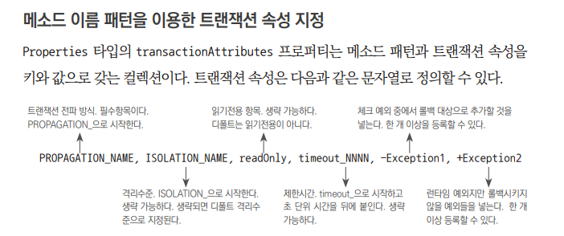

## 6.6 트랜잭션 속성

#### TransactionDefinition 인터페이스의 속성

1. 트랜잭션 전파(transaction propagation)
   트랜잭션의 경계에서 이미 진행 중인 트랜잭션이 있을 때의 동작 방식 정의

+ Propagation_REQUIRED
진행 중인 트랜잭션이 없으면 새로 시작 
이미 시작된 트랜잭션이 있으면 이에 참여

+ Propagation_REQUIRES_NEW
진행 중인 트랜잭션의 유무와 관계 없이 
항상 새로운 트랜잭션 시작

+ Propagation_NOT_SUPPORTED
진행 중인 트랜잭션의 유무와 관계 없이 
트랜잭션 없이 동작 
모든 메소드에 트랜잭션 AOP 적용 
특정 메소드의 트랜잭션 속성만 해당 속성을 적용한다

2. 격리 수준(isolation level)

가능한 한 많은 트랜잭션을 동시에 진행하면서 
문제가 발생하지 않게 하는 제어

3. 제한 시간(timeout)

트랜잭션을 수행하는 제한시간 설정

4. 읽기 전용(read only)

트랜잭션 내에서 데이터를 조작하는 시도를 막는다

#### TransactionInterceptor
메소드 이름 패턴에 따라 다른 트랜잭션 정의 적용 
스프링에 기본적으로 존재 
런타임 예외 -> 트랜잭션 롤백 
체크드 예외 -> 비즈니스 로직에 따른 리턴방식으로 인식 -> 트랜잭션 커밋

트랜잭션 적용 타깃 클래스 메소드: 모두 트랜잭션 적용 후보 
트랜잭션용 표현식 - 메소드, 파라미터, 예외에 대한 패턴을 정의하지 않는 게 바람직하다

같은 객체 안에서의 호출은 새로운 트랜잭션 속성을 부여하지 못함

